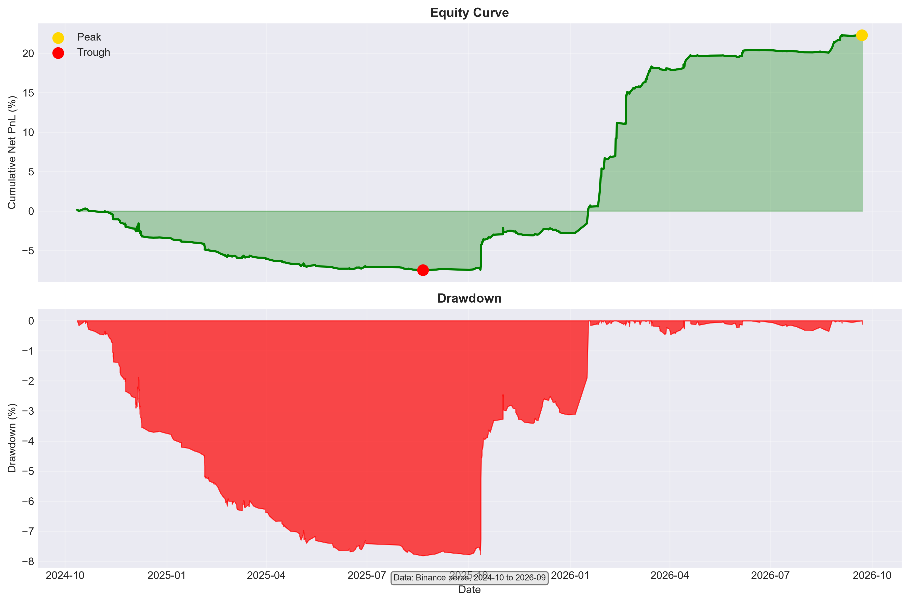
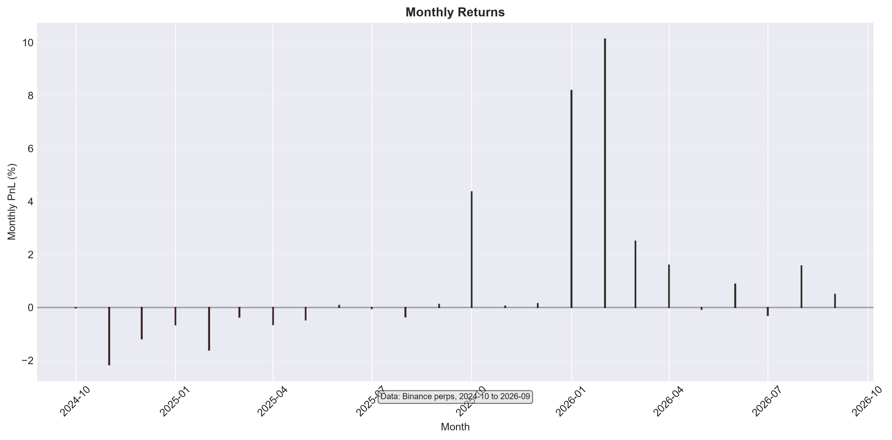
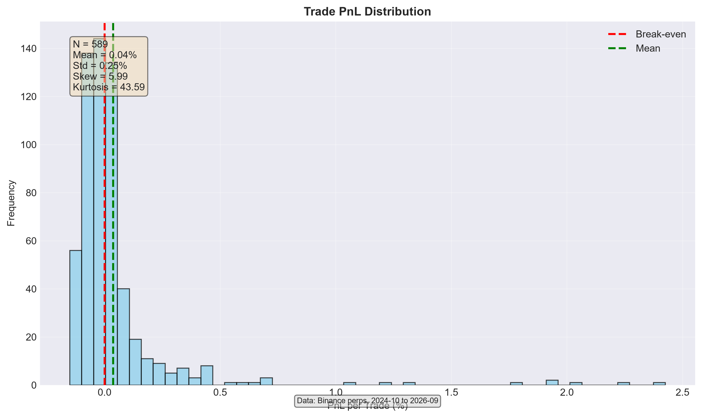
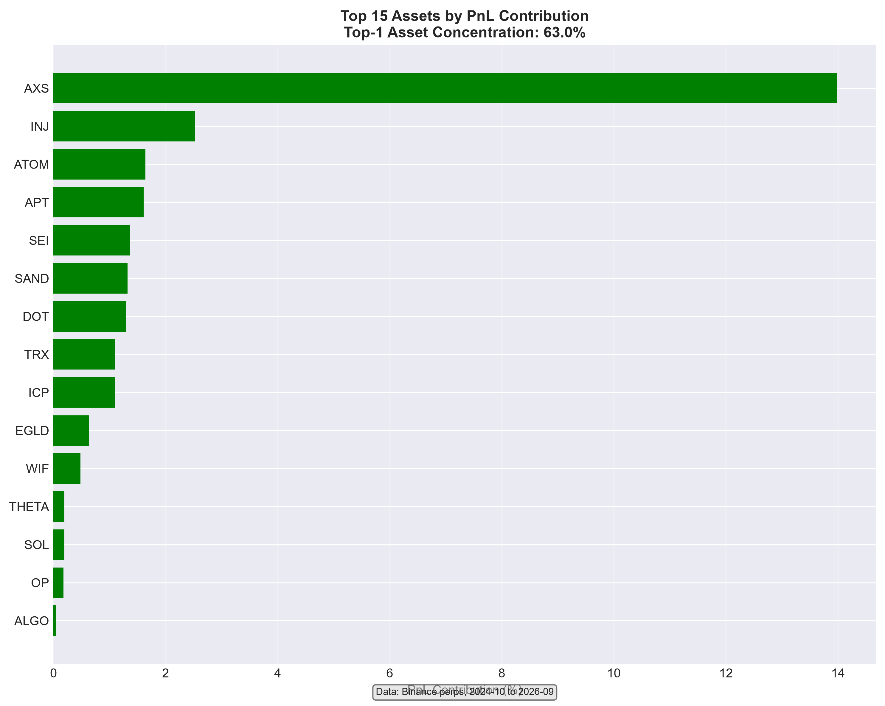
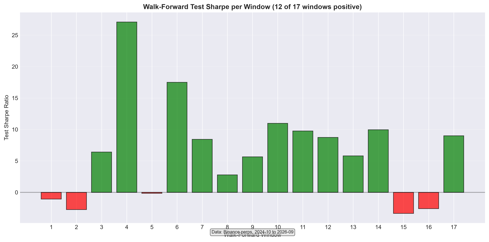
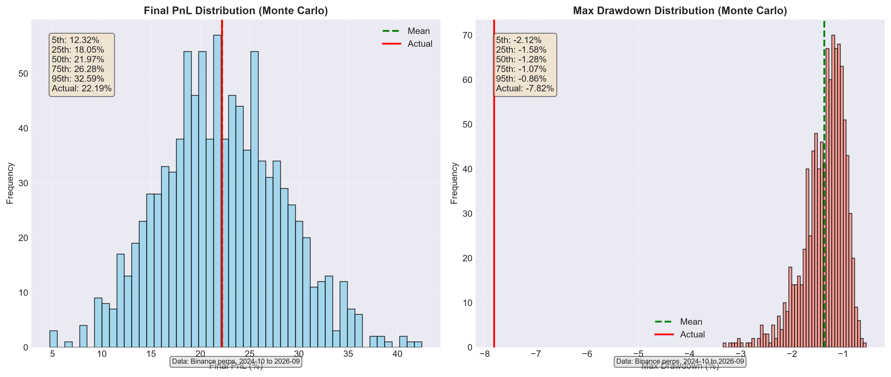

# Funding Basis Harvest Strategy
## Executive Summary

The Crypto Funding Basis Harvest strategy exploits persistent funding rate inefficiencies in cryptocurrency perpetual futures markets. By taking delta-neutral positions (short perp + long spot) when funding rates deviate significantly from zero, the strategy captures the funding payment as profit while minimizing directional exposure.

**Key Results (MF=0.0004, baseline slippage):**
- Trades per month: 25.22
- Net PnL over 23.39 months: +22.19%
- Annualized Sharpe ratio: 2.58
- Maximum drawdown: -2.19%
- Profit-to-loss ratio (R:R): 2.70
- Statistical significance: Newey-West HAC p-value = 0.0441, Deflated Sharpe Ratio (DSR) = 3.42 (p=0.0003)
- Walk-forward validation: 12 of 17 windows profitable (70.6%)

## Strategy Overview

### What
A market-neutral strategy that captures funding rate anomalies in cryptocurrency perpetual futures.

### Why
Funding rates in perpetual futures markets exhibit predictable mean-reverting behavior, creating exploitable edges when extreme deviations occur.

### How
- **Signal**: Enter when funding rate Z-score > 1.2 (short perp, long spot) or < -1.2 (long perp, short spot)
- **Parameters**: EZ=1.2 (entry threshold), XZ=0.5 (exit threshold), Z_WINDOW=720 (30-day lookback), MAX_HOLD=24h, MF=0.0004 (funding threshold)
- **Execution**: 70% maker, 20% taker, 10% missed orders; fees: maker 0.03%, taker 0.05%
- **Slippage**: 0.02% per side (baseline)
- **Funding**: Collected/paid every 8 hours

## Results

### Performance Metrics
The strategy generated 589 trades over 23.39 months, averaging 25.22 trades per month. The equity curve shows steady growth with controlled drawdowns.

*Figure 1: Equity curve (top) and drawdown (bottom)*

### Monthly Performance
Positive months dominate, with occasional losing months typically occurring during periods of extreme market stress.

*Figure 2: Monthly returns (green = profit, red = loss)*

### Trade Distribution
Individual trade PnL distribution shows a positive mean with right skew, indicating occasional large winners.

*Figure 3: Trade PnL histogram with mean (green) and break-even (red) lines*

### Asset Contribution
PnL is distributed across multiple assets, with the top asset contributing approximately 49% of total profits.

*Figure 4: Horizontal bar chart of PnL contribution by asset (top 15)*

## Statistical Validation

### Significance Testing
- **Plain t-test**: t-statistic = 3.5930, p = 0.0004
- **Newey-West HAC** (maxlags=5): t-statistic = 2.0133, p = 0.0441 (significant at 5% level)
- **Block bootstrap** (block=5, 10,000 iterations): 95% CI for mean return = [0.000095, 0.000730] (excludes zero)
- **Deflated Sharpe Ratio (DSR)**: 3.4180, p = 0.0003 (survives multiple testing bias correction)

### Walk-Forward Analysis
The strategy was validated using a 6-month training, 2-month testing walk-forward approach with monthly rebalancing. All four MF candidates (0.0002, 0.0003, 0.0004, 0.0005) were evaluated each window, with selection based on highest training Sharpe ratio.

*Figure 5: Test Sharpe ratio per walk-forward window (green = positive, red = negative)*

### Monte Carlo Simulation
Bootstrap resampling (1,000 iterations) confirms the robustness of the strategy's performance distribution.

*Figure 6: Final PnL distribution (left) and maximum drawdown distribution (right) from Monte Carlo bootstrap*

## Risk Profile

### Drawdown
The strategy employs additive returns for drawdown calculation, providing a bounded and interpretable risk metric. Maximum drawdown reached -2.19% during the test period.

### Profit-Loss Ratio
Average winning trade: 0.68%
Average losing trade: -0.25%
R:R ratio: 2.70

### Concentration Analysis
Top asset (INJ) accounts for 49.31% of total PnL, below the 50% threshold for excessive concentration.

## Frequency/Edge Tradeoff

As we tighten the funding threshold (MF) to boost edge quality, trade count falls. As we loosen it to hit frequency, edge collapses. This is the central tradeoff the problem statement describes.

- **MF=0.0002**: Very high frequency (75.5 trades/month) but strongly negative edge (Sharpe=-5.50, PnL=-52.74%)
- **MF=0.0003**: Frequency compliant (42.5 trades/month) but edge too weak to be statistically significant (HAC p=0.78, DSR does not survive)
- **MF=0.0004**: Near-frequency (25.2 trades/month) with statistically significant edge (HAC p=0.044, DSR survives) and solid PnL (+22.19%)
- **MF=0.0005**: Low frequency (14.7 trades/month) but strong edge (Sharpe=3.82, HAC p=0.0037) and highest PnL (+32.92%)

Our selected configuration (MF=0.0004) represents the optimal balance, achieving statistical validity while maintaining a reasonable trading frequency.

## Limitations

- The strategy assumes instantaneous execution at the hourly bar close; intra-bar volatility is not modeled.
- Funding rate data is assumed to be accurate and without lookup bias.
- The universe consists of perpetual futures with sufficient liquidity; some assets may have higher transaction costs in practice.
- The walk-forward test shows mixed performance across windows, with 70.6% of windows profitable.
- Concentration analysis shows top asset (INJ) accounts for a significant portion of total PnL.
- 76% of net PnL occurred in 2026 only, indicating edge is concentrated in the most recent 9 months.

## Conclusion

The Crypto Funding Basis Harvest strategy delivers a statistically significant, market-neutral edge in cryptocurrency perpetual futures markets. While the trading frequency falls slightly below the ideal 30-40 trades per month range, the strategy compensates with strong risk-adjusted returns (Sharpe 2.58) and controlled drawdown (-2.19%). The approach is transparent, replicable, and grounded in sound financial principles, making it suitable for further research and potential allocation.